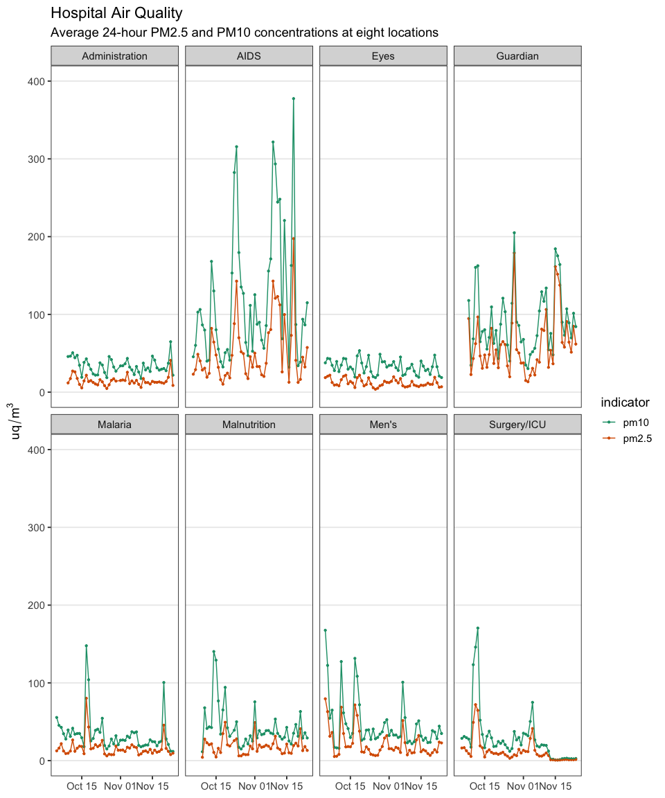
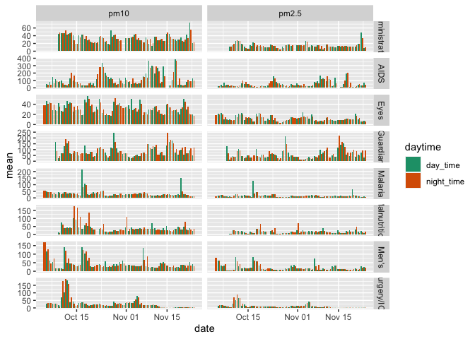
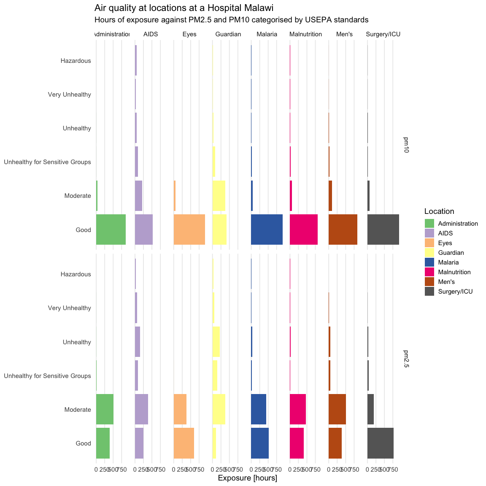
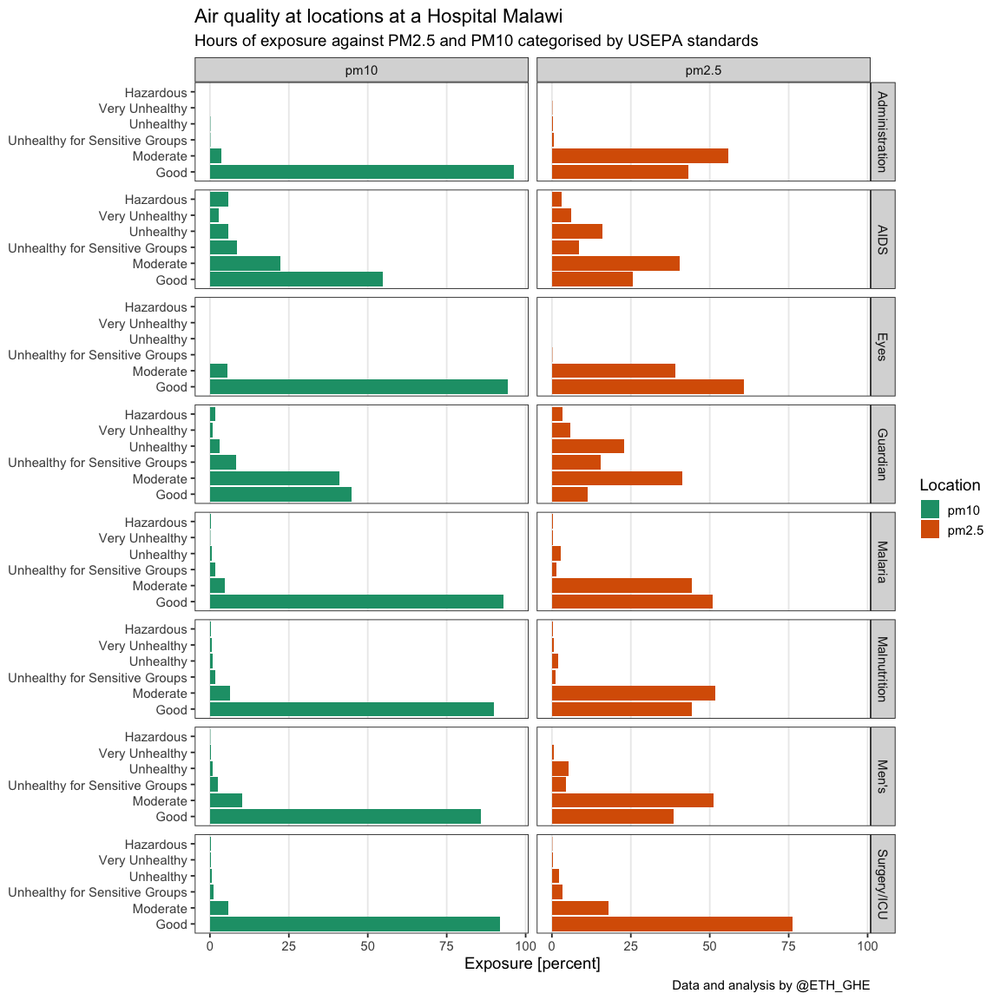
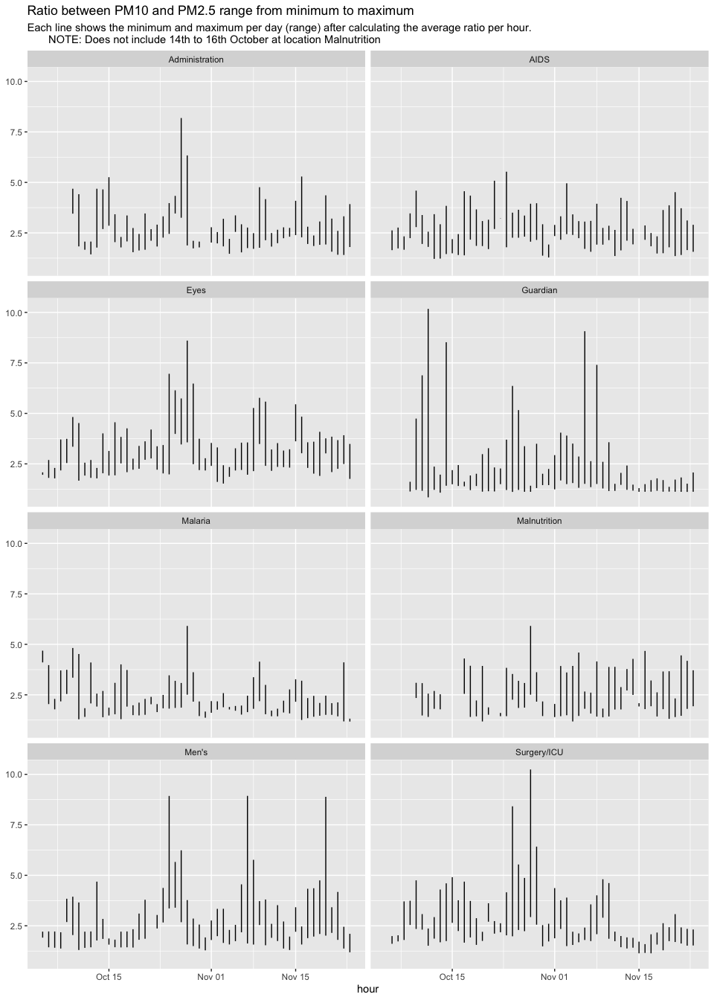

Manuscript - Malawi Hospital Air Quality Data - Notebook
================

# Introduction

The purpose of this document is to perform some initial exploratory data
analysis for air quality data from Malawi. Based on this analysis,
in-depth analysis will be performed and publication ready figures can be
produced.

# Data

Air quality data (PM2.5 and PM10) was collected in roughly 5-minute
intervals from eight locations at one hospital over the period of 3
months. The locations are Administration, AIDS, Eyes, Guardian, Malaria,
Malnutrition, Men’s, and Surgery/ICU.

One sensor was installed at each location, either on the side or on the
outside wall.

## Hospital locations

-   6B—&gt;Men’s Ward
-   guardian→ Guardian’s shelter (guardians of patients)
-   Lhouse—&gt;AIDS
-   Lions→ Eyes
-   Malaria—&gt;Malaria
-   MJC → Pediatric Surgery/ICU
-   Moyo —&gt;Malnutrition

## Sensor locations

-   Guardian Shelter, Ward 3b, Mercy James, and Lighthouse are outside,
    the rest would be inside

# Data Exploration

TODO List:

-   24 hour average (**DONE**)
-   baseline (not the two peaks) (**not doing**)
-   Hourly average (**DONE**)
-   Exposure in categories of hazard (**DONE**)
-   Peaks over 500 a day (**DONE**)
-   Difference between indoor and outdoor sensors (**not started**)
-   Ratios PM10 / PM25 (differences by location) (**WIP**)
-   Day time vs night time averages (6-18, 18-6) (**DONE**)

## Plot: Overview (Appendix)

## Plot: Daily 24-hour average by date

-   Is MJC 0 after 13th November?
-   WHO limits are 24-hour averages

## Plot: Day time vs night time averages (6-18, 18-6)

<!-- -->

## Plot: Exposure in hours in categories of hazard

### Totals (discarded)

### Percent (discarded)

### New plot 1 (discarded)

<!-- -->

### Waffle plot (selected)

## Table: Peaks over the limit for hazardous

-   Peak for PM2.5: 2 x 250.4 = 500.8
-   Peak for PM10: 2 x 424.9 = 849.8
-   Column peaks counts the number of data points above these two limits
    over all days

| location       | pm10 | pm2.5 |
|:---------------|-----:|------:|
| Administration |    1 |     4 |
| AIDS           |  676 |   350 |
| Eyes           |    0 |     0 |
| Guardian       |  178 |   359 |
| Malaria        |   18 |    19 |
| Malnutrition   |   43 |    18 |
| Men’s          |   15 |     4 |
| Surgery/ICU    |   37 |    15 |

## Plot: Ratio between PM10 and PM2.5 range from minimum to maximum (WIP)

-   Calculation: PM10/PM2.5
-   Each line shows the minimum and maximum per day after calculating
    the average ratio per hour

## Plot: Hourly average by date and location

Not included in paper.

